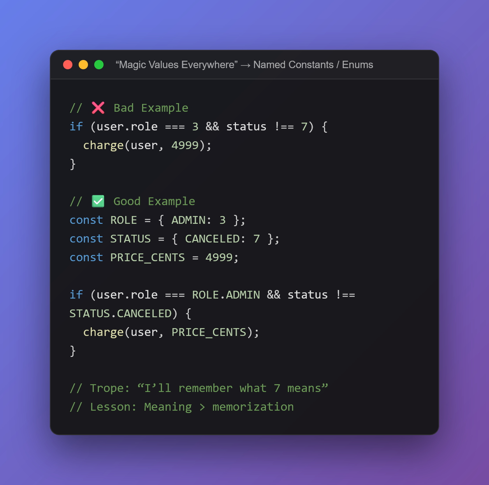

# BEGE (Bad Example, Good Example)

**BEGE** is a beautiful, web-based tool for creating aesthetic code screenshots. Whether you're sharing a "Bad Example" to warn others or a "Good Example" to teach, BEGE makes your snippets look premium.



## Features

- **🎨 Robust Theming**: Choose from industry-standard themes like Dracula, Monokai, Nord, Solarized, and GitHub.
- **🌈 Custom Gradients**: Use presets or build your own gradient background (Start Color, End Color, Angle).
- **🪟 Window Styles**: Toggle between macOS, Windows, or Minimalist window headers.
- **🌍 Multi-Language Support**: Syntax highlighting for JS/TS, Python, Ruby, Java, C/C++, HTML, CSS, and JSON.
- **📏 Fine-Grained Control**: Adjust the window Width and Padding to frame your code perfectly.
- **📸 Seamless Export**: One-click PNG export that perfectly captures your snippet with the background.

## Tech Stack

- **React** (Vite)
- **PrismJS** for syntax highlighting.
- **html-to-image** for generation.
- **Lucide React** for icons.

## Getting Started

1.  **Install dependencies**:
    ```bash
    npm install
    ```

2.  **Run Development Server**:
    ```bash
    npm run dev
    ```

3.  **Open in Browser**:
    http://localhost:5173

## Project Structure

- `src/components/PreviewFrame.jsx`: The main visual container (handles the transparent/seamless logic).
- `src/components/ThemeControls.jsx`: The sidebar for customization (Language, Gradients, Dimensions).
- `src/constants/themes.js`: Central source of truth for all color themes and token colors.
- `src/App.jsx`: Main state manager and Export logic.

## License

Licensed under the Apache License, Version 2.0 (the "License");
you may not use this file except in compliance with the License.
You may obtain a copy of the License at

    http://www.apache.org/licenses/LICENSE-2.0

Unless required by applicable law or agreed to in writing, software
distributed under the License is distributed on an "AS IS" BASIS,
WITHOUT WARRANTIES OR CONDITIONS OF ANY KIND, either express or implied.
See the License for the specific language governing permissions and
limitations under the License.
